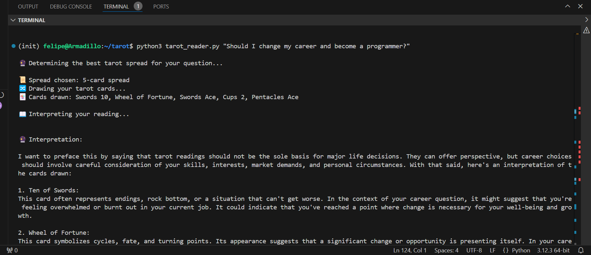

# 🔮 Tarot Reader CLI - AI-Powered Tarot Readings with Amazon Bedrock

Welcome to **Tarot Reader CLI**, a simple yet powerful command-line tool that provides **AI-generated tarot readings** using **Claude 3.5 Sonnet** via **Amazon Bedrock**. 

## Screenshot


This tool allows users to ask **career, life, or spiritual questions**, and the AI will:
1. Determine whether a **3-card or 5-card tarot spread** is best for the question.
2. Draw the appropriate number of cards **randomly from a full tarot deck**.
3. Provide a **detailed tarot reading**, explaining each card and summarizing key takeaways.
4. **Embed reasoning for the spread choice** naturally into the tarot interpretation.

## 🚀 Features
- **AI-driven tarot reading** powered by Amazon Bedrock (Claude 3.5 Sonnet).
- **Automatic spread selection** (3 or 5 cards) based on the complexity of the question.
- **Clear and structured readings** with each card's meaning explained in context.
- **CLI-based for quick access**, perfect for scripting or personal exploration.
- **Full 78-card tarot deck** including both Major and Minor Arcana.

## 🛠️ Installation

1. **Clone this repository**:
   ```sh
   git clone https://github.com/yourusername/tarot-reader-cli.git
   cd tarot-reader-cli
   ```

2. **Create a virtual environment and activate it**:
   ```sh
   python3 -m venv env
   source env/bin/activate  # On macOS/Linux
   env\Scripts\activate     # On Windows
   ```

3. **Install dependencies**:
   ```sh
   pip install -r requirements.txt
   ```

4. **Ensure you have AWS credentials configured** (for Amazon Bedrock access):
   ```sh
   aws configure
   ```
   Make sure you have permission to use **Claude 3.5 Sonnet** on **Amazon Bedrock** in `us-west-2`.

## 🎯 Usage

To get a tarot reading, run:

```sh
python3 tarot_reader.py "Your question here"
```

### **Example 1: Career Change**
```sh
python3 tarot_reader.py "Should I change my career?"
```

## 🎴 How It Works
1. **Determining the Spread:**  
   - If the question is simple (past-present-future), it uses **3 cards**.  
   - If the question is complex (e.g., career, relationships), it uses **5 cards**.

2. **Drawing the Cards:**  
   - The tarot deck is shuffled, and the correct number of cards are drawn.

3. **Generating the Reading:**  
   - AI provides a **detailed interpretation** for each drawn card.
   - **The reasoning for the spread is embedded into the response**.
   - The final reading includes **a structured summary**.

## 🏗️ Future Enhancements
- ✅ Add reversed tarot card meanings.
- ✅ Implement more spread types (Celtic Cross, Love, etc.).
- ✅ Create a **web version** for tarot readings online.
- ✅ Build a **Discord bot** for community tarot readings.

## ❤️ Contributing
Want to improve the project? Feel free to:
- **Submit issues** for bugs or feature requests.
- **Fork the repo** and submit pull requests.
- **Share feedback** on how the readings feel!

## 📜 License
This project is **open-source** under the MIT License. Feel free to modify and share.

---

### ✨ **Connect with Me**
📧 **Email:** felipe@debene.xyz
 

🚀 **Enjoy your tarot readings! May clarity and wisdom be with you!** 🔮✨
